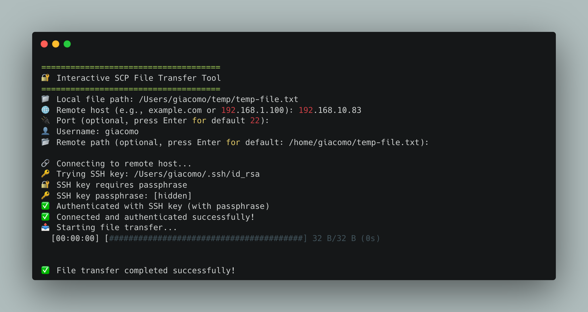

# 🔐 Interactive SCP Client (iscp)

A user-friendly, interactive SCP (Secure Copy Protocol) client written in Rust that simplifies secure file transfers over SSH. This tool provides an intuitive command-line interface for uploading files to remote servers with progress tracking and multiple authentication methods.



## ✨ Features

- **Interactive CLI**: Step-by-step prompts guide you through the transfer process
- **Progress Tracking**: Real-time progress bar with transfer speed and ETA
- **Multiple Authentication Methods**:
  - SSH key authentication (with optional passphrase)
  - Password authentication (fallback)
- **Smart Defaults**: Automatically suggests sensible remote paths
- **Cross-Platform**: Works on Linux, macOS, and Windows
- **Secure**: Built on the robust `ssh2` crate for reliable SSH connections

## 🚀 Quick Start

### Prerequisites

- Rust 1.70+ (for the 2024 edition)
- SSH access to your target server

### Installation

1. **Clone the repository:**

   ```bash
   git clone https://github.com/byte3-it/iscp.git
   cd iscp
   ```

2. **Build the project:**

   ```bash
   cargo build --release
   ```

3. **Run the application:**
   ```bash
   cargo run --release
   ```

### Usage

Simply run the application and follow the interactive prompts:

```bash
cargo run --release
```

The application will guide you through:

1. **Local file path** - The file you want to upload
2. **Remote host** - Target server (e.g., `example.com` or `192.168.1.100`)
3. **Port** - SSH port (default: 22)
4. **Username** - Your SSH username
5. **Remote path** - Destination path on the remote server (optional)

### Example Session

```
=====================================
🔐 Interactive SCP File Transfer Tool
=====================================
📁 Local file path: ./my-document.pdf
🌐 Remote host (e.g., example.com or 192.168.1.100): myserver.com
🔌 Port (optional, press Enter for default 22):
👤 Username: myuser
📂 Remote path (optional, press Enter for default: /home/myuser/my-document.pdf):

🔗 Connecting to remote host...
🔑 Trying SSH key: /Users/myuser/.ssh/id_rsa
✅ Authenticated with SSH key (no passphrase)
✅ Connected and authenticated successfully!
📤 Starting file transfer...
████████████████████████████████████████ 100% (2.1MB/2.1MB) (00:03)

✅ File transfer completed successfully!
```

## 🛠️ Development

### Setting Up Development Environment

1. **Clone the repository:**

   ```bash
   git clone https://github.com/yourusername/iscp.git
   cd iscp
   ```

2. **Install dependencies:**

   ```bash
   cargo build
   ```

3. **Run in development mode:**
   ```bash
   cargo run
   ```

### Project Structure

```
iscp/
├── src/
│   └── main.rs          # Main application logic
├── Cargo.toml           # Project dependencies and metadata
├── Cargo.lock           # Locked dependency versions
└── README.md           # This file
```

### Key Dependencies

- **`ssh2`** - SSH2 protocol implementation for secure connections
- **`indicatif`** - Progress bars and terminal UI components
- **`dialoguer`** - Interactive command-line prompts
- **`console`** - Terminal styling and colors

### Contributing

We welcome contributions! Here's how you can help:

1. **Fork the repository** on GitHub
2. **Create a feature branch:**
   ```bash
   git checkout -b feature/your-feature-name
   ```
3. **Make your changes** and test them thoroughly
4. **Run tests** (when available):
   ```bash
   cargo test
   ```
5. **Commit your changes:**
   ```bash
   git commit -m "Add your feature description"
   ```
6. **Push to your fork:**
   ```bash
   git push origin feature/your-feature-name
   ```
7. **Create a Pull Request** on GitHub

### Development Guidelines

- Follow Rust naming conventions
- Add comments for complex logic
- Test your changes with various file types and sizes
- Ensure the code compiles without warnings
- Consider edge cases (network failures, authentication issues, etc.)

## ⚠️ Current Limitations

**Important**: This is an early version of the project with the following limitations:

- **Upload Only**: Currently, the tool only supports uploading files from local to remote servers
- **No Download Support**: Downloading files from remote to local is not yet implemented
- **Single File Transfer**: Only one file can be transferred per session
- **No Directory Support**: Directory transfers are not supported

### Planned Features

- [ ] Download files from remote servers
- [ ] Directory transfer support
- [ ] Batch file transfers
- [ ] Configuration file support
- [ ] Resume interrupted transfers
- [ ] Transfer verification (checksums)
- [ ] Custom SSH port configuration
- [ ] Verbose logging options

## 🔧 Configuration

### SSH Key Setup

For the best experience, set up SSH key authentication:

1. **Generate an SSH key** (if you don't have one):

   ```bash
   ssh-keygen -t ed25519 -C "your_email@example.com"
   ```

2. **Copy your public key to the remote server:**

   ```bash
   ssh-copy-id username@your-server.com
   ```

3. **Test the connection:**
   ```bash
   ssh username@your-server.com
   ```

## 🐛 Troubleshooting

### Common Issues

**Authentication Failed:**

- Ensure your SSH key is properly configured
- Check that the remote server allows key-based authentication
- Verify your username and server address

**Connection Timeout:**

- Check your network connection
- Verify the server address and port
- Ensure the remote server is running SSH

**File Transfer Fails:**

- Verify you have write permissions on the remote path
- Check available disk space on the remote server
- Ensure the remote directory exists

## 📄 License

This project is open source. Please check the LICENSE file for details.

## 🤝 Support

- **Issues**: Report bugs and request features on [GitHub Issues](https://github.com/yourusername/iscp/issues)
- **Discussions**: Join the conversation on [GitHub Discussions](https://github.com/yourusername/iscp/discussions)

## 🙏 Acknowledgments

- Built with the amazing Rust ecosystem
- Uses the excellent `ssh2` crate for SSH functionality
- Inspired by the need for a more user-friendly SCP experience

---

**Happy transferring! 🚀**
